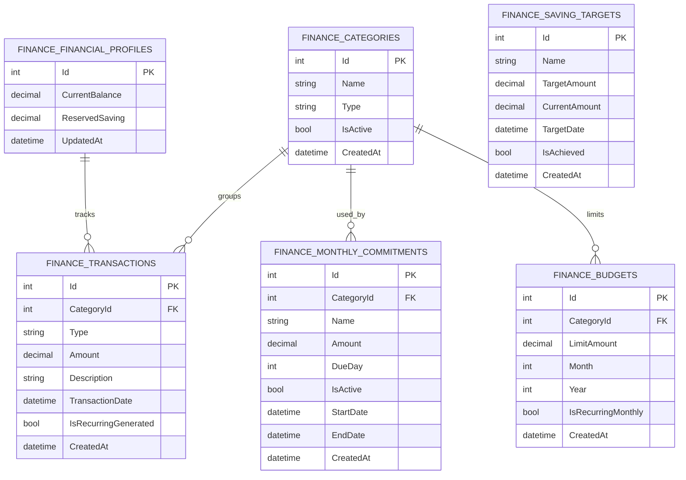
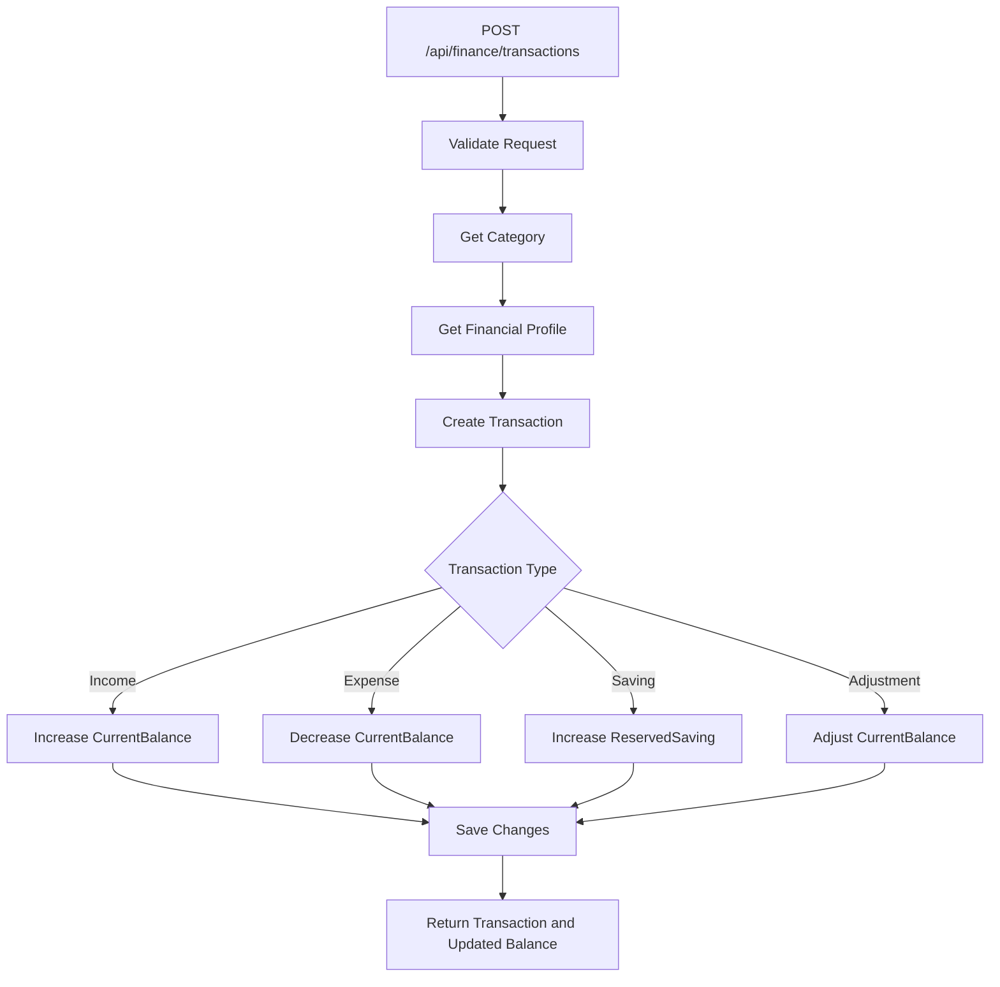
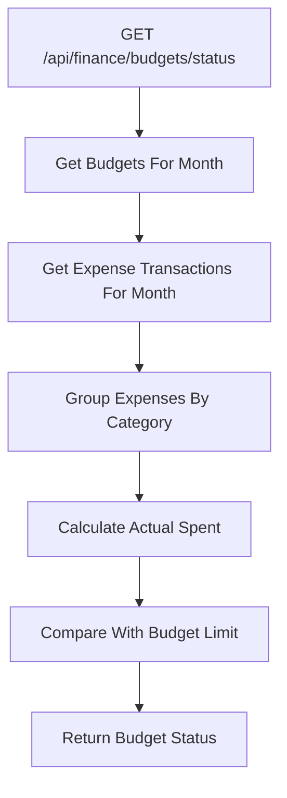
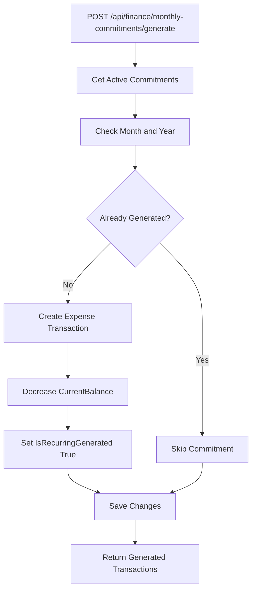
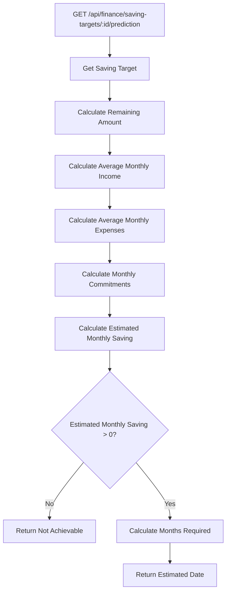

# App Vault Finance Module - Backend Documentation

## 1. Module Overview

The Finance Module is a backend module inside the App Vault system.

This module is not a full standalone finance application. It is only responsible for personal finance tracking features inside App Vault.

The Finance Module focuses on:

* Current balance tracking
* Reserved saving tracking
* Available to spend calculation
* Income and expense transactions
* Monthly commitments
* Budgets
* Saving targets
* Saving prediction
* Finance dashboard API

This module is designed for personal use only.

Version 1 does not include:

* User registration
* Login
* Multi-user support
* Multi-account support
* E-statement import
* Monthly summary table
* Budget summary table
* Saving contribution history table
* Recurring generation log table

Those features can be added later if needed.

---

## 2. Backend Goal

The main goal of this backend module is to answer these questions:

1. How much money do I currently have?
2. How much money is reserved for saving?
3. How much money can I safely spend?
4. What have I spent this month?
5. Am I breaching my budget?
6. What monthly commitments do I have?
7. When can I reach my saving target?

---

## 3. Core Financial Concept

The Finance Module uses one main financial profile.

There is no multiple account tracking in version 1.

The source of money is treated as one saving account.

### 3.1 CurrentBalance

`CurrentBalance` means the actual amount of money currently available in the saving account.

Example:

```text
CurrentBalance = RM 5,000
```

This should represent the real current balance.

### 3.2 ReservedSaving

`ReservedSaving` means the amount of money that is reserved and should not be spent.

Example:

```text
ReservedSaving = RM 1,500
```

This does not mean the money is stored in a different account.

It only means that RM 1,500 from the current balance is considered reserved for saving goals.

### 3.3 AvailableToSpend

`AvailableToSpend` is calculated by the backend.

Formula:

```text
AvailableToSpend = CurrentBalance - ReservedSaving
```

Example:

```text
CurrentBalance = RM 5,000
ReservedSaving = RM 1,500
AvailableToSpend = RM 3,500
```

Meaning:

```text
There is RM 5,000 in the saving account,
but only RM 3,500 is safe to spend,
because RM 1,500 is reserved.
```

`AvailableToSpend` should not be stored in the database.

It should be calculated in the response DTO.

---

## 4. Currency

The currency is always MYR for version 1.

No `Currency` column is required in the database.

The backend can return currency as a constant value.

Example:

```csharp
public static class FinanceConstants
{
    public const string Currency = "MYR";
}
```

---

## 5. Clean Architecture Structure

The Finance Module should be grouped by module inside each Clean Architecture layer.

Recommended structure:

```text
AppVault.Api/
└── Controllers/
    └── Finance/
        ├── FinanceDashboardController.cs
        ├── FinanceFinancialProfileController.cs
        ├── FinanceCategoriesController.cs
        ├── FinanceTransactionsController.cs
        ├── FinanceMonthlyCommitmentsController.cs
        ├── FinanceBudgetsController.cs
        └── FinanceSavingTargetsController.cs
```

```text
AppVault.Application/
└── Finance/
    ├── DTOs/
    │   ├── Dashboard/
    │   ├── FinancialProfile/
    │   ├── Categories/
    │   ├── Transactions/
    │   ├── MonthlyCommitments/
    │   ├── Budgets/
    │   └── SavingTargets/
    │
    ├── Interfaces/
    │   ├── IFinanceDashboardService.cs
    │   ├── IFinanceFinancialProfileService.cs
    │   ├── IFinanceCategoryService.cs
    │   ├── IFinanceTransactionService.cs
    │   ├── IFinanceMonthlyCommitmentService.cs
    │   ├── IFinanceBudgetService.cs
    │   └── IFinanceSavingTargetService.cs
    │
    └── Services/
        ├── FinanceDashboardService.cs
        ├── FinanceFinancialProfileService.cs
        ├── FinanceCategoryService.cs
        ├── FinanceTransactionService.cs
        ├── FinanceMonthlyCommitmentService.cs
        ├── FinanceBudgetService.cs
        └── FinanceSavingTargetService.cs
```

```text
AppVault.Domain/
└── Finance/
    ├── Entities/
    │   ├── FinanceFinancialProfile.cs
    │   ├── FinanceCategory.cs
    │   ├── FinanceTransaction.cs
    │   ├── FinanceMonthlyCommitment.cs
    │   ├── FinanceBudget.cs
    │   └── FinanceSavingTarget.cs
    │
    └── Enums/
        ├── FinanceCategoryType.cs
        └── FinanceTransactionType.cs
```

```text
AppVault.Infrastructure/
└── Finance/
    ├── Configurations/
    │   ├── FinanceFinancialProfileConfiguration.cs
    │   ├── FinanceCategoryConfiguration.cs
    │   ├── FinanceTransactionConfiguration.cs
    │   ├── FinanceMonthlyCommitmentConfiguration.cs
    │   ├── FinanceBudgetConfiguration.cs
    │   └── FinanceSavingTargetConfiguration.cs
    │
    └── Repositories/
        └── FinanceRepository.cs
```

---

## 6. Version 1 Database Tables

Version 1 should only use these tables:

```text
FinanceFinancialProfiles
FinanceCategories
FinanceTransactions
FinanceMonthlyCommitments
FinanceBudgets
FinanceSavingTargets
```

Avoid adding extra tables too early.

Do not add these yet:

```text
FinanceStatementImports
FinanceMonthlySummaries
FinanceBudgetSummaries
FinanceSavingTargetContributions
FinanceRecurringGenerationLogs
```

These can be version 2 or version 3 features.

---

## 7. Entity Relationship Diagram



---

## 8. Domain Enums

### 8.1 FinanceCategoryType

```csharp
namespace AppVault.Domain.Finance.Enums;

public enum FinanceCategoryType
{
    Income = 1,
    Expense = 2,
    Saving = 3
}
```

### 8.2 FinanceTransactionType

```csharp
namespace AppVault.Domain.Finance.Enums;

public enum FinanceTransactionType
{
    Income = 1,
    Expense = 2,
    Saving = 3,
    Adjustment = 4
}
```

---

## 9. Domain Entities

### 9.1 FinanceFinancialProfile

```csharp
namespace AppVault.Domain.Finance.Entities;

public class FinanceFinancialProfile
{
    public int Id { get; set; }

    public decimal CurrentBalance { get; set; }

    public decimal ReservedSaving { get; set; }

    public DateTime UpdatedAt { get; set; }

    public decimal AvailableToSpend => CurrentBalance - ReservedSaving;

    public ICollection<FinanceTransaction> Transactions { get; set; } = new List<FinanceTransaction>();
}
```

### 9.2 FinanceCategory

```csharp
using AppVault.Domain.Finance.Enums;

namespace AppVault.Domain.Finance.Entities;

public class FinanceCategory
{
    public int Id { get; set; }

    public string Name { get; set; } = string.Empty;

    public FinanceCategoryType Type { get; set; }

    public bool IsActive { get; set; } = true;

    public DateTime CreatedAt { get; set; }

    public ICollection<FinanceTransaction> Transactions { get; set; } = new List<FinanceTransaction>();

    public ICollection<FinanceMonthlyCommitment> MonthlyCommitments { get; set; } = new List<FinanceMonthlyCommitment>();

    public ICollection<FinanceBudget> Budgets { get; set; } = new List<FinanceBudget>();
}
```

### 9.3 FinanceTransaction

```csharp
using AppVault.Domain.Finance.Enums;

namespace AppVault.Domain.Finance.Entities;

public class FinanceTransaction
{
    public int Id { get; set; }

    public int FinanceFinancialProfileId { get; set; }

    public int CategoryId { get; set; }

    public FinanceTransactionType Type { get; set; }

    public decimal Amount { get; set; }

    public string? Description { get; set; }

    public DateTime TransactionDate { get; set; }

    public bool IsRecurringGenerated { get; set; }

    public DateTime CreatedAt { get; set; }

    public FinanceFinancialProfile FinancialProfile { get; set; } = null!;

    public FinanceCategory Category { get; set; } = null!;
}
```

### 9.4 FinanceMonthlyCommitment

```csharp
namespace AppVault.Domain.Finance.Entities;

public class FinanceMonthlyCommitment
{
    public int Id { get; set; }

    public int CategoryId { get; set; }

    public string Name { get; set; } = string.Empty;

    public decimal Amount { get; set; }

    public int DueDay { get; set; }

    public bool IsActive { get; set; } = true;

    public DateTime StartDate { get; set; }

    public DateTime? EndDate { get; set; }

    public DateTime CreatedAt { get; set; }

    public FinanceCategory Category { get; set; } = null!;
}
```

### 9.5 FinanceBudget

```csharp
namespace AppVault.Domain.Finance.Entities;

public class FinanceBudget
{
    public int Id { get; set; }

    public int CategoryId { get; set; }

    public decimal LimitAmount { get; set; }

    public int Month { get; set; }

    public int Year { get; set; }

    public bool IsRecurringMonthly { get; set; }

    public DateTime CreatedAt { get; set; }

    public FinanceCategory Category { get; set; } = null!;
}
```

### 9.6 FinanceSavingTarget

```csharp
namespace AppVault.Domain.Finance.Entities;

public class FinanceSavingTarget
{
    public int Id { get; set; }

    public string Name { get; set; } = string.Empty;

    public decimal TargetAmount { get; set; }

    public decimal CurrentAmount { get; set; }

    public DateTime? TargetDate { get; set; }

    public bool IsAchieved { get; set; }

    public DateTime CreatedAt { get; set; }
}
```

---

## 10. Backend Business Rules

### 10.1 General Rules

1. The Finance Module is for personal use only.
2. No registration or login is required for version 1.
3. The module tracks only one financial profile.
4. The currency is always MYR.
5. `AvailableToSpend` is calculated, not stored.
6. Categories should be deactivated instead of hard deleted if they are already used.
7. Amount must always be greater than 0 for normal transactions.
8. Month value must be between 1 and 12.
9. Due day value must be between 1 and 31.

### 10.2 Transaction Rules

| Transaction Type | Effect                           |
| ---------------- | -------------------------------- |
| Income           | Increase `CurrentBalance`        |
| Expense          | Decrease `CurrentBalance`        |
| Saving           | Increase `ReservedSaving`        |
| Adjustment       | Adjust `CurrentBalance` manually |

For saving transaction:

```text
CurrentBalance does not increase.
ReservedSaving increases.
```

Reason:

```text
The money is already inside the saving account.
Saving transaction only marks part of it as reserved.
```

Example:

```text
CurrentBalance = RM 5,000
ReservedSaving = RM 1,500

Add Saving RM 500

CurrentBalance = RM 5,000
ReservedSaving = RM 2,000
AvailableToSpend = RM 3,000
```

### 10.3 Budget Rules

1. Budget is created per category, month, and year.
2. Budget status is calculated from expense transactions.
3. Actual spending only counts transactions with type `Expense`.
4. A budget is breached when actual spending is greater than the budget limit.
5. Budget summary does not need to be stored in version 1.
6. Budget status can be calculated live.

Formula:

```text
ActualSpent = SUM(expense transactions by category for selected month)

RemainingAmount = LimitAmount - ActualSpent

IsBreached = ActualSpent > LimitAmount
```

### 10.4 Monthly Commitment Rules

1. Monthly commitment represents fixed monthly expenses.
2. Example commitments are room rent, travel pass, prepaid, subscriptions, and insurance.
3. Monthly commitments can be generated as expense transactions.
4. Generated transactions should set `IsRecurringGenerated = true`.
5. The backend should prevent duplicate generated commitments for the same month.

For version 1, duplicate checking can use:

```text
CategoryId
Description
Month
Year
IsRecurringGenerated = true
```

A separate recurring generation log table is not required for version 1.

### 10.5 Saving Target Rules

1. Saving target represents a financial goal.
2. Example target: Emergency Fund RM 10,000.
3. `CurrentAmount` tracks progress.
4. When `CurrentAmount >= TargetAmount`, the target is achieved.
5. For version 1, one active saving target is enough.
6. Saving prediction uses average monthly income and average monthly expenses.

---

## 11. API Routes

All Finance Module routes should use the `/api/finance` prefix.

### 11.1 Dashboard

```http
GET /api/finance/dashboard
```

Returns the finance dashboard summary.

The dashboard should include:

* Current balance
* Reserved saving
* Available to spend
* Currency
* Saving target summary
* Budget status
* Recent transactions

### 11.2 Financial Profile

```http
GET /api/finance/financial-profile
PUT /api/finance/financial-profile
```

### 11.3 Categories

```http
GET /api/finance/categories
POST /api/finance/categories
GET /api/finance/categories/{id}
PUT /api/finance/categories/{id}
DELETE /api/finance/categories/{id}
```

### 11.4 Transactions

```http
GET /api/finance/transactions
GET /api/finance/transactions/{id}
POST /api/finance/transactions
PUT /api/finance/transactions/{id}
DELETE /api/finance/transactions/{id}
```

Optional query filters:

```http
GET /api/finance/transactions?month=6&year=2026
GET /api/finance/transactions?type=Expense
GET /api/finance/transactions?categoryId=2
```

### 11.5 Monthly Commitments

```http
GET /api/finance/monthly-commitments
GET /api/finance/monthly-commitments/{id}
POST /api/finance/monthly-commitments
PUT /api/finance/monthly-commitments/{id}
DELETE /api/finance/monthly-commitments/{id}
POST /api/finance/monthly-commitments/generate?month=6&year=2026
```

### 11.6 Budgets

```http
GET /api/finance/budgets
GET /api/finance/budgets/{id}
GET /api/finance/budgets?month=6&year=2026
POST /api/finance/budgets
PUT /api/finance/budgets/{id}
DELETE /api/finance/budgets/{id}
GET /api/finance/budgets/status?month=6&year=2026
```

### 11.7 Saving Targets

```http
GET /api/finance/saving-targets
GET /api/finance/saving-targets/{id}
POST /api/finance/saving-targets
PUT /api/finance/saving-targets/{id}
DELETE /api/finance/saving-targets/{id}
GET /api/finance/saving-targets/{id}/prediction
```

---

## 12. DTOs

### 12.1 FinanceFinancialProfileResponseDto

```csharp
namespace AppVault.Application.Finance.DTOs.FinancialProfile;

public class FinanceFinancialProfileResponseDto
{
    public decimal CurrentBalance { get; set; }

    public decimal ReservedSaving { get; set; }

    public decimal AvailableToSpend { get; set; }

    public string Currency { get; set; } = "MYR";

    public DateTime UpdatedAt { get; set; }
}
```

### 12.2 UpdateFinanceFinancialProfileRequestDto

```csharp
namespace AppVault.Application.Finance.DTOs.FinancialProfile;

public class UpdateFinanceFinancialProfileRequestDto
{
    public decimal CurrentBalance { get; set; }

    public decimal ReservedSaving { get; set; }
}
```

### 12.3 FinanceCategoryResponseDto

```csharp
using AppVault.Domain.Finance.Enums;

namespace AppVault.Application.Finance.DTOs.Categories;

public class FinanceCategoryResponseDto
{
    public int Id { get; set; }

    public string Name { get; set; } = string.Empty;

    public FinanceCategoryType Type { get; set; }

    public bool IsActive { get; set; }
}
```

### 12.4 CreateFinanceCategoryRequestDto

```csharp
using AppVault.Domain.Finance.Enums;

namespace AppVault.Application.Finance.DTOs.Categories;

public class CreateFinanceCategoryRequestDto
{
    public string Name { get; set; } = string.Empty;

    public FinanceCategoryType Type { get; set; }
}
```

### 12.5 FinanceTransactionResponseDto

```csharp
using AppVault.Domain.Finance.Enums;

namespace AppVault.Application.Finance.DTOs.Transactions;

public class FinanceTransactionResponseDto
{
    public int Id { get; set; }

    public int CategoryId { get; set; }

    public string CategoryName { get; set; } = string.Empty;

    public FinanceTransactionType Type { get; set; }

    public decimal Amount { get; set; }

    public string? Description { get; set; }

    public DateTime TransactionDate { get; set; }

    public bool IsRecurringGenerated { get; set; }
}
```

### 12.6 CreateFinanceTransactionRequestDto

```csharp
using AppVault.Domain.Finance.Enums;

namespace AppVault.Application.Finance.DTOs.Transactions;

public class CreateFinanceTransactionRequestDto
{
    public int CategoryId { get; set; }

    public FinanceTransactionType Type { get; set; }

    public decimal Amount { get; set; }

    public string? Description { get; set; }

    public DateTime TransactionDate { get; set; }
}
```

### 12.7 CreateFinanceBudgetRequestDto

```csharp
namespace AppVault.Application.Finance.DTOs.Budgets;

public class CreateFinanceBudgetRequestDto
{
    public int CategoryId { get; set; }

    public decimal LimitAmount { get; set; }

    public int Month { get; set; }

    public int Year { get; set; }

    public bool IsRecurringMonthly { get; set; }
}
```

### 12.8 FinanceBudgetStatusResponseDto

```csharp
namespace AppVault.Application.Finance.DTOs.Budgets;

public class FinanceBudgetStatusResponseDto
{
    public int CategoryId { get; set; }

    public string CategoryName { get; set; } = string.Empty;

    public decimal LimitAmount { get; set; }

    public decimal ActualSpent { get; set; }

    public decimal RemainingAmount { get; set; }

    public bool IsBreached { get; set; }
}
```

### 12.9 CreateFinanceMonthlyCommitmentRequestDto

```csharp
namespace AppVault.Application.Finance.DTOs.MonthlyCommitments;

public class CreateFinanceMonthlyCommitmentRequestDto
{
    public int CategoryId { get; set; }

    public string Name { get; set; } = string.Empty;

    public decimal Amount { get; set; }

    public int DueDay { get; set; }

    public DateTime StartDate { get; set; }

    public DateTime? EndDate { get; set; }
}
```

### 12.10 FinanceSavingTargetResponseDto

```csharp
namespace AppVault.Application.Finance.DTOs.SavingTargets;

public class FinanceSavingTargetResponseDto
{
    public int Id { get; set; }

    public string Name { get; set; } = string.Empty;

    public decimal TargetAmount { get; set; }

    public decimal CurrentAmount { get; set; }

    public decimal RemainingAmount { get; set; }

    public decimal ProgressPercentage { get; set; }

    public DateTime? TargetDate { get; set; }

    public bool IsAchieved { get; set; }
}
```

### 12.11 CreateFinanceSavingTargetRequestDto

```csharp
namespace AppVault.Application.Finance.DTOs.SavingTargets;

public class CreateFinanceSavingTargetRequestDto
{
    public string Name { get; set; } = string.Empty;

    public decimal TargetAmount { get; set; }

    public decimal CurrentAmount { get; set; }

    public DateTime? TargetDate { get; set; }
}
```

### 12.12 FinanceSavingPredictionResponseDto

```csharp
namespace AppVault.Application.Finance.DTOs.SavingTargets;

public class FinanceSavingPredictionResponseDto
{
    public decimal TargetAmount { get; set; }

    public decimal CurrentAmount { get; set; }

    public decimal RemainingAmount { get; set; }

    public decimal AverageMonthlyIncome { get; set; }

    public decimal AverageMonthlyExpenses { get; set; }

    public decimal MonthlyCommitments { get; set; }

    public decimal EstimatedMonthlySaving { get; set; }

    public int? EstimatedMonthsRequired { get; set; }

    public DateTime? EstimatedAchievementDate { get; set; }

    public bool IsAchievable { get; set; }

    public string Message { get; set; } = string.Empty;
}
```

### 12.13 FinanceDashboardResponseDto

```csharp
namespace AppVault.Application.Finance.DTOs.Dashboard;

public class FinanceDashboardResponseDto
{
    public decimal CurrentBalance { get; set; }

    public decimal ReservedSaving { get; set; }

    public decimal AvailableToSpend { get; set; }

    public string Currency { get; set; } = "MYR";

    public FinanceDashboardSavingTargetDto? SavingTarget { get; set; }

    public List<FinanceDashboardBudgetStatusDto> BudgetStatuses { get; set; } = new();

    public List<FinanceDashboardTransactionDto> RecentTransactions { get; set; } = new();
}

public class FinanceDashboardSavingTargetDto
{
    public int Id { get; set; }

    public string Name { get; set; } = string.Empty;

    public decimal TargetAmount { get; set; }

    public decimal CurrentAmount { get; set; }

    public decimal ProgressPercentage { get; set; }

    public int? EstimatedMonthsRequired { get; set; }
}

public class FinanceDashboardBudgetStatusDto
{
    public string CategoryName { get; set; } = string.Empty;

    public decimal LimitAmount { get; set; }

    public decimal ActualSpent { get; set; }

    public decimal RemainingAmount { get; set; }

    public bool IsBreached { get; set; }
}

public class FinanceDashboardTransactionDto
{
    public int Id { get; set; }

    public string CategoryName { get; set; } = string.Empty;

    public string Type { get; set; } = string.Empty;

    public decimal Amount { get; set; }

    public string? Description { get; set; }

    public DateTime TransactionDate { get; set; }
}
```

---

## 13. Core Backend Flows

### 13.1 Create Transaction Flow



### 13.2 Budget Status Flow



### 13.3 Generate Monthly Commitments Flow



### 13.4 Saving Prediction Flow



---

## 14. Important Service Logic

### 14.1 Apply Transaction To Financial Profile

```csharp
private void ApplyTransactionToProfile(
    FinanceFinancialProfile profile,
    FinanceTransactionType type,
    decimal amount)
{
    switch (type)
    {
        case FinanceTransactionType.Income:
            profile.CurrentBalance += amount;
            break;

        case FinanceTransactionType.Expense:
            profile.CurrentBalance -= amount;
            break;

        case FinanceTransactionType.Saving:
            profile.ReservedSaving += amount;
            break;

        case FinanceTransactionType.Adjustment:
            profile.CurrentBalance += amount;
            break;

        default:
            throw new InvalidOperationException("Invalid transaction type.");
    }

    profile.UpdatedAt = DateTime.UtcNow;
}
```

### 14.2 Calculate Budget Status

```csharp
public FinanceBudgetStatusResponseDto CalculateBudgetStatus(
    FinanceBudget budget,
    List<FinanceTransaction> transactions)
{
    var actualSpent = transactions
        .Where(x =>
            x.CategoryId == budget.CategoryId &&
            x.Type == FinanceTransactionType.Expense)
        .Sum(x => x.Amount);

    var remainingAmount = budget.LimitAmount - actualSpent;

    return new FinanceBudgetStatusResponseDto
    {
        CategoryId = budget.CategoryId,
        CategoryName = budget.Category.Name,
        LimitAmount = budget.LimitAmount,
        ActualSpent = actualSpent,
        RemainingAmount = remainingAmount,
        IsBreached = actualSpent > budget.LimitAmount
    };
}
```

### 14.3 Calculate Saving Prediction

```csharp
public FinanceSavingPredictionResponseDto PredictSavingTarget(
    decimal targetAmount,
    decimal currentAmount,
    decimal averageMonthlyIncome,
    decimal averageMonthlyExpenses,
    decimal monthlyCommitments)
{
    var remainingAmount = targetAmount - currentAmount;

    var estimatedMonthlySaving =
        averageMonthlyIncome - averageMonthlyExpenses - monthlyCommitments;

    if (remainingAmount <= 0)
    {
        return new FinanceSavingPredictionResponseDto
        {
            TargetAmount = targetAmount,
            CurrentAmount = currentAmount,
            RemainingAmount = 0,
            AverageMonthlyIncome = averageMonthlyIncome,
            AverageMonthlyExpenses = averageMonthlyExpenses,
            MonthlyCommitments = monthlyCommitments,
            EstimatedMonthlySaving = estimatedMonthlySaving,
            EstimatedMonthsRequired = 0,
            EstimatedAchievementDate = DateTime.UtcNow,
            IsAchievable = true,
            Message = "Saving target already achieved."
        };
    }

    if (estimatedMonthlySaving <= 0)
    {
        return new FinanceSavingPredictionResponseDto
        {
            TargetAmount = targetAmount,
            CurrentAmount = currentAmount,
            RemainingAmount = remainingAmount,
            AverageMonthlyIncome = averageMonthlyIncome,
            AverageMonthlyExpenses = averageMonthlyExpenses,
            MonthlyCommitments = monthlyCommitments,
            EstimatedMonthlySaving = estimatedMonthlySaving,
            EstimatedMonthsRequired = null,
            EstimatedAchievementDate = null,
            IsAchievable = false,
            Message = "Target is not achievable based on current average income and expenses."
        };
    }

    var monthsRequired = (int)Math.Ceiling(remainingAmount / estimatedMonthlySaving);

    return new FinanceSavingPredictionResponseDto
    {
        TargetAmount = targetAmount,
        CurrentAmount = currentAmount,
        RemainingAmount = remainingAmount,
        AverageMonthlyIncome = averageMonthlyIncome,
        AverageMonthlyExpenses = averageMonthlyExpenses,
        MonthlyCommitments = monthlyCommitments,
        EstimatedMonthlySaving = estimatedMonthlySaving,
        EstimatedMonthsRequired = monthsRequired,
        EstimatedAchievementDate = DateTime.UtcNow.AddMonths(monthsRequired),
        IsAchievable = true,
        Message = $"Target may be achieved in approximately {monthsRequired} month(s)."
    };
}
```

---

## 15. Dashboard API Response Example

Endpoint:

```http
GET /api/finance/dashboard
```

Response:

```json
{
  "currentBalance": 5000,
  "reservedSaving": 1500,
  "availableToSpend": 3500,
  "currency": "MYR",
  "savingTarget": {
    "id": 1,
    "name": "Emergency Fund",
    "targetAmount": 10000,
    "currentAmount": 1500,
    "progressPercentage": 15,
    "estimatedMonthsRequired": 7
  },
  "budgetStatuses": [
    {
      "categoryName": "Food",
      "limitAmount": 500,
      "actualSpent": 420,
      "remainingAmount": 80,
      "isBreached": false
    },
    {
      "categoryName": "Entertainment",
      "limitAmount": 200,
      "actualSpent": 230,
      "remainingAmount": -30,
      "isBreached": true
    }
  ],
  "recentTransactions": [
    {
      "id": 10,
      "categoryName": "Food",
      "type": "Expense",
      "amount": 15,
      "description": "Lunch",
      "transactionDate": "2026-06-10T00:00:00"
    }
  ]
}
```

---

## 16. Recommended Default Categories

Seed these categories when the Finance Module is initialized.

### Income Categories

```text
Salary
Freelance
Bonus
Allowance
Other Income
```

### Expense Categories

```text
Food
Room Rent
Travel Pass
Prepaid
Transport
Shopping
Entertainment
Health
Subscription
Emergency
Other Expense
```

### Saving Categories

```text
Saving
Emergency Fund
Investment
Travel Saving
House Saving
```

---

## 17. Recommended Development Order

Build the backend in this order:

```text
1. Finance enums
2. Finance entities
3. EF Core configurations
4. DbContext updates
5. Database migration
6. Seed default finance categories
7. Financial profile API
8. Category API
9. Transaction API
10. Budget API
11. Budget status API
12. Monthly commitment API
13. Generate monthly commitment API
14. Saving target API
15. Saving prediction API
16. Dashboard API
```

Do not start with the dashboard first.

Dashboard depends on financial profile, transactions, budgets, and saving target.

---

## 18. Version Plan

### Version 1

Version 1 should include:

```text
Financial Profile
Categories
Transactions
Monthly Commitments
Budgets
Saving Targets
Saving Prediction
Dashboard
```

### Version 2

Version 2 can include:

```text
Monthly summary table
Budget summary table
Saving contribution history
Recurring generation log table
Better reports
```

### Version 3

Version 3 can include:

```text
CSV e-statement import
Excel e-statement import
PDF e-statement import
Auto category detection
Duplicate transaction detection
```

---

## 19. Version 1 Completion Criteria

The Finance Module version 1 is complete when:

1. Financial profile can be created and updated.
2. Categories can be created and listed.
3. Transactions can be created and listed.
4. Income transaction increases current balance.
5. Expense transaction decreases current balance.
6. Saving transaction increases reserved saving.
7. Available to spend is calculated correctly.
8. Budgets can be created.
9. Budget status can be calculated.
10. Monthly commitments can be created.
11. Monthly commitments can generate expense transactions.
12. Saving target can be created.
13. Saving prediction works.
14. Dashboard endpoint returns a complete summary.

---

## 20. Final Notes

Keep the Finance Module simple in version 1.

The most important backend flow is:

```text
Transaction is created
Financial profile is updated
Dashboard shows latest money status
Budget status is recalculated
Saving prediction is recalculated
```

The Finance Module should not try to do everything immediately.

Start with the core flow first:

```text
Profile → Categories → Transactions → Budgets → Commitments → Saving Target → Dashboard
```

Once this works properly, advanced features such as statement import and monthly summaries can be added later.
