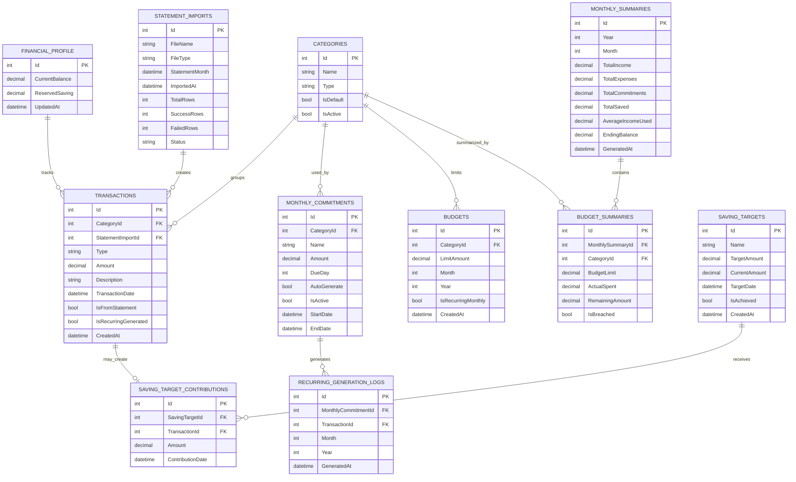

# Expenses API Documentation

Here is the updated full version based on your latest decision:

* No user/auth/login
* No multi-account
* Only one money source: your saving account
* Currency is always MYR
* Use `CurrentBalance`, `ReservedSaving`, and calculated `AvailableToSpend`
* Monthly commitments auto-generate expenses
* Budgets track spending limits
* E-statement upload supported
* Prediction uses average monthly income

---

# Final ERD



---

# Expenses API Documentation

## 1. Project Overview

The Expenses API is a personal finance tracking system built using C# and ASP.NET Core Web API.

This API is designed for personal use only. It does not require user registration, login, authentication, or multiple user management.

The system focuses on tracking one main saving account. All income, expenses, savings, commitments, budgets, and e-statement imports are recorded against this personal financial profile.

The API helps track:

* Current balance
* Reserved savings
* Available money to spend
* Income
* Expenses
* Monthly commitments
* Monthly budgets
* E-statement imports
* Saving targets
* Saving prediction

The system can automatically generate monthly commitment expenses, check whether spending has breached budget limits, and predict when a saving target can be achieved based on average monthly income and expense behavior.

---

## 2. Core Financial Concept

The system uses three important financial values.

### 2.1 CurrentBalance

`CurrentBalance` means the actual amount of money currently available in the saving account.

Example:

CurrentBalance = RM 5,000

This should match the real saving account balance from the bank or e-statement.

### 2.2 ReservedSaving

`ReservedSaving` means the amount of money that should not be spent because it is reserved for saving goals.

Example:

ReservedSaving = RM 2,000

This does not mean the money is stored in a different bank account. It only means part of the current balance is marked as reserved.

### 2.3 AvailableToSpend

`AvailableToSpend` is calculated by the system.

Formula:

AvailableToSpend = CurrentBalance - ReservedSaving

Example:

CurrentBalance = RM 5,000
ReservedSaving = RM 2,000
AvailableToSpend = RM 3,000

Meaning:

The account has RM 5,000, but only RM 3,000 is safe to spend because RM 2,000 is reserved for savings.

`AvailableToSpend` does not need to be stored in the database. It can be calculated in the API response.

---

## 3. Currency

The currency is always MYR for now.

Because of that, the `Currency` column is not required in the database.

The API can hardcode the currency as MYR in constants, configuration, or API responses.

Example:

```csharp
public const string Currency = "MYR";
```

---

## 4. Main Features

## 4.1 Financial Profile

The financial profile stores the main financial overview.

It includes:

* Current balance
* Reserved saving
* Last updated date

Only one financial profile is needed because the system is for personal use only.

---

## 4.2 Categories

Categories are used to group transactions, monthly commitments, and budgets.

Example expense categories:

* Food
* Room Rent
* Travel Pass
* Prepaid
* Shopping
* Entertainment
* Health
* Emergency
* Subscription

Example income categories:

* Salary
* Freelance
* Bonus
* Allowance

Example saving categories:

* Emergency Fund
* Travel Saving
* Investment
* House Saving

---

## 4.3 Transactions

Transactions store all money movements.

Transaction types:

* Income
* Expense
* Saving
* Adjustment

### Income

Income increases `CurrentBalance`.

Example:

Salary RM 3,000 is added.

CurrentBalance increases by RM 3,000.

### Expense

Expense decreases `CurrentBalance`.

Example:

Food RM 20 is added.

CurrentBalance decreases by RM 20.

### Saving

Saving increases `ReservedSaving`.

Example:

The user reserves RM 500 for emergency saving.

ReservedSaving increases by RM 500.

Since the money is already inside the saving account, `CurrentBalance` does not need to increase again.

### Adjustment

Adjustment is used to manually correct the balance.

Example:

The bank balance is RM 4,820, but the system shows RM 4,800.

An adjustment of RM 20 can be added.

---

## 4.4 Monthly Commitments

Monthly commitments are fixed expenses that happen every month.

Examples:

* Room rent
* Travel pass
* Prepaid
* Subscriptions
* Insurance
* Loan payment

The system should automatically generate expense transactions from active monthly commitments.

Example:

Room Rent
Amount: RM 600
Due day: 1
Auto generate: true

Every month, the system creates a Room Rent expense transaction.

The system should prevent duplicate commitment transactions from being generated for the same month.

---

## 4.5 Budgets

Budgets are used to set spending limits by category.

Example:

Food budget: RM 500 per month
Entertainment budget: RM 200 per month
Shopping budget: RM 300 per month

The system compares actual spending against the budget limit.

Example:

Food budget: RM 500
Actual food spending: RM 580

Result:

Budget breached by RM 80.

---

## 4.6 E-Statement Import

The system should support uploading e-statements.

The user may upload an e-statement around the 15th of each month.

The system should read the uploaded statement and convert valid rows into transactions.

The statement import should track:

* File name
* File type
* Statement month
* Imported date
* Total rows
* Success rows
* Failed rows
* Import status

---

## 4.7 Saving Targets

Saving targets are goals such as emergency fund, travel fund, house fund, or investment fund.

The system should track:

* Target name
* Target amount
* Current amount
* Target date
* Achieved status

The system should also track contributions made from transactions.

---

## 4.8 Saving Prediction

The system should estimate when a saving target can be achieved.

This prediction should use average monthly income.

Example:

* Target amount: RM 10,000
* Current amount: RM 4,000
* Average monthly saving: RM 1,500

The system can estimate how many months are needed to reach the target.

If the average monthly saving is not enough or is zero, the target should be marked as not achievable for now.

---

## 5. Database Tables

The tables in the ERD above represent the main database structure.

They include:

* Financial profile
* Categories
* Transactions
* Monthly commitments
* Recurring generation logs
* Budgets
* Saving targets
* Saving target contributions
* Statement imports
* Monthly summaries
* Budget summaries

---

## 6. API Endpoints

### 6.1 Financial Profile

* `GET /api/financial-profile` - Returns `CurrentBalance`, `ReservedSaving`, `AvailableToSpend`, and `UpdatedAt`.
* `PUT /api/financial-profile` - Updates `CurrentBalance` and/or `ReservedSaving`.

### 6.2 Categories

* `GET /api/categories` - List all categories.
* `POST /api/categories` - Create a new category.
* `GET /api/categories/{id}` - Retrieve one category.
* `PUT /api/categories/{id}` - Update a category.
* `DELETE /api/categories/{id}` - Deactivate a category.

### 6.3 Transactions

* `GET /api/transactions` - List all transactions.
* `GET /api/transactions?month=6&year=2026` - Filter by month/year.
* `GET /api/transactions/{id}` - Get a specific transaction.
* `POST /api/transactions` - Create a manual transaction.
* `PUT /api/transactions/{id}` - Update a transaction.
* `DELETE /api/transactions/{id}` - Delete or reverse a transaction.

### 6.4 Monthly Commitments

* `GET /api/monthly-commitments` - List commitments.
* `POST /api/monthly-commitments` - Create commitment.
* `GET /api/monthly-commitments/{id}` - Get commit.
* `PUT /api/monthly-commitments/{id}` - Update.
* `DELETE /api/monthly-commitments/{id}` - Deactivate.
* `POST /api/monthly-commitments/generate?month=6&year=2026` - Auto-generate expense transactions.

### 6.5 Budgets

* `GET /api/budgets` - List budgets.
* `GET /api/budgets?month=6&year=2026` - Budgets for a month.
* `POST /api/budgets` - Create.
* `GET /api/budgets/{id}` - Retrieve.
* `PUT /api/budgets/{id}` - Update.
* `DELETE /api/budgets/{id}` - Delete/deactivate.
* `GET /api/budgets/status?month=6&year=2026` - Get usage and breach status.

### 6.6 Statement Imports

* `POST /api/statement-imports/upload` - Upload CSV/Excel.
* `GET /api/statement-imports` - History.
* `GET /api/statement-imports/{id}` - Details.
* `POST /api/statement-imports/{id}/confirm` - Confirm imported rows.
* `DELETE /api/statement-imports/{id}` - Remove import and pending rows.

### 6.7 Saving Targets

* `GET /api/saving-targets` - List.
* `POST /api/saving-targets` - Create.
* `GET /api/saving-targets/{id}` - Retrieve.
* `PUT /api/saving-targets/{id}` - Update.
* `DELETE /api/saving-targets/{id}` - Delete.
* `POST /api/saving-targets/{id}/contribute` - Add contribution.
* `GET /api/saving-targets/{id}/prediction` - Predict achievement date.

### 6.8 Reports

* `GET /api/reports/monthly?month=6&year=2026` - Monthly financial summary.
* `GET /api/reports/budget?month=6&year=2026` - Budget performance.
* `GET /api/reports/average-income?months=6` - Average income.
* `GET /api/reports/summary` - Overall summary.

---

## 7. Business Rules

1. Single personal user - no authentication.
2. Currency fixed to MYR.
3. Income increases `CurrentBalance`; expense decreases it.
4. Saving transactions increase `ReservedSaving`.
5. `AvailableToSpend = CurrentBalance - ReservedSaving` (calculated).
6. Auto-generated commitments must not duplicate within the same month.
7. Budgets are breached when actual spending > limit.
8. Imported transactions require user confirmation before becoming permanent.
9. Prediction uses average monthly income over the last 6 months.
10. Deactivate instead of delete where possible.

---

## 8. Technology Stack

* **Backend:** C#, ASP.NET Core Web API
* **ORM:** Entity Framework Core
* **Database:** PostgreSQL (production), SQLite (tests)
* **Background Jobs:** Hangfire or Quartz.NET (for auto-generation and imports)
* **File Parsing:** CsvHelper, EPPlus (Excel)

---

## 9. Folder Structure (excerpt)

```text
ExpensesApi/
├─ Controllers/
├─ Services/
├─ Repositories/
├─ Entities/
├─ DTOs/
├─ Data/
├─ Migrations/
├─ Helpers/
├─ BackgroundJobs/
├─ FileImports/
├─ Validators/
├─ Constants/
├─ Enums/
└─ Program.cs
```

---

## 10. Enums

```csharp
public enum CategoryType { Income = 1, Expense = 2, Saving = 3 }
```

```csharp
public enum TransactionType { Income = 1, Expense = 2, Saving = 3, Adjustment = 4 }
```

```csharp
public enum StatementImportStatus { Pending = 1, Confirmed = 2, Failed = 3, Cancelled = 4 }
```

---

## 11. DTO Samples

*FinancialProfileResponseDto, CreateTransactionRequestDto, SavingPredictionResultDto* (as defined in the original user content).

---

## 12. Prediction Service (excerpt)

```csharp
public SavingPredictionResultDto PredictSavingTarget(...)
```

---

## 13. Average Income Calculation (excerpt)

```csharp
public decimal CalculateAverageMonthlyIncome(List<Transaction> transactions, int months)
```

---

## 14. Auto-Generate Commitment Logic (excerpt)

```csharp
public List<Transaction> GenerateMonthlyCommitmentTransactions(...)
```

---

## 15. Budget Status Logic (excerpt)

```csharp
public BudgetSummary CalculateBudgetStatus(...)
```

---

*End of documentation.*
