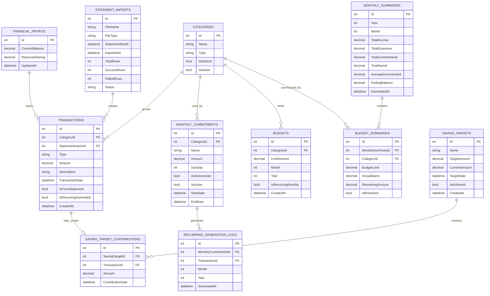

# Expenses Table ERD

```mermaid id="expenses-api-erd"
erDiagram
    FINANCIAL_PROFILE ||--o{ TRANSACTIONS : tracks
    CATEGORIES ||--o{ TRANSACTIONS : groups
    CATEGORIES ||--o{ MONTHLY_COMMITMENTS : used_by
    CATEGORIES ||--o{ BUDGETS : limits
    CATEGORIES ||--o{ BUDGET_SUMMARIES : summarized_by
    SAVING_TARGETS ||--o{ SAVING_TARGET_CONTRIBUTIONS : receives
    TRANSACTIONS ||--o| SAVING_TARGET_CONTRIBUTIONS : may_create
    STATEMENT_IMPORTS ||--o{ TRANSACTIONS : creates
    MONTHLY_COMMITMENTS ||--o{ RECURRING_GENERATION_LOGS : generates
    MONTHLY_SUMMARIES ||--o{ BUDGET_SUMMARIES : contains

    FINANCIAL_PROFILE {
        int Id PK
        decimal CurrentBalance
        decimal ReservedSaving
        datetime UpdatedAt
    }

    CATEGORIES {
        int Id PK
        string Name
        string Type
        bool IsDefault
        bool IsActive
    }

    TRANSACTIONS {
        int Id PK
        int CategoryId FK
        int StatementImportId FK
        string Type
        decimal Amount
        string Description
        datetime TransactionDate
        bool IsFromStatement
        bool IsRecurringGenerated
        datetime CreatedAt
    }

    MONTHLY_COMMITMENTS {
        int Id PK
        int CategoryId FK
        string Name
        decimal Amount
        int DueDay
        bool AutoGenerate
        bool IsActive
        datetime StartDate
        datetime EndDate
    }

    RECURRING_GENERATION_LOGS {
        int Id PK
        int MonthlyCommitmentId FK
        int TransactionId FK
        int Month
        int Year
        datetime GeneratedAt
    }

    BUDGETS {
        int Id PK
        int CategoryId FK
        decimal LimitAmount
        int Month
        int Year
        bool IsRecurringMonthly
        datetime CreatedAt
    }

    SAVING_TARGETS {
        int Id PK
        string Name
        decimal TargetAmount
        decimal CurrentAmount
        datetime TargetDate
        bool IsAchieved
        datetime CreatedAt
    }

    SAVING_TARGET_CONTRIBUTIONS {
        int Id PK
        int SavingTargetId FK
        int TransactionId FK
        decimal Amount
        datetime ContributionDate
    }

    STATEMENT_IMPORTS {
        int Id PK
        string FileName
        string FileType
        datetime StatementMonth
        datetime ImportedAt
        int TotalRows
        int SuccessRows
        int FailedRows
        string Status
    }

    MONTHLY_SUMMARIES {
        int Id PK
        int Year
        int Month
        decimal TotalIncome
        decimal TotalExpenses
        decimal TotalCommitments
        decimal TotalSaved
        decimal AverageIncomeUsed
        decimal EndingBalance
        datetime GeneratedAt
    }

    BUDGET_SUMMARIES {
        int Id PK
        int MonthlySummaryId FK
        int CategoryId FK
        decimal BudgetLimit
        decimal ActualSpent
        decimal RemainingAmount
        bool IsBreached
    }
```
